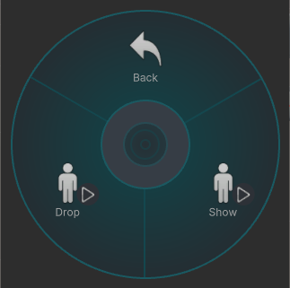

# VRCWorldDrop

**Simple world drop toggle for avatars**. Drag-n-drop installation with VRCFury. Quest compatible!

Add your custom object to the prefab, set the menu path, and upload. Copy-paste onto other avatars to reuse!

[**Download the latest version**](https://github.com/gummidot/VRCWorldDrop/releases/tag/v1.0.0)

## Requirements

- VRChat SDK 3.7.0 or later (**IMPORTANT!!** if you haven't updated your project since August 16, 2024)
- [VRCFury](https://vrcfury.com/)

## Prefabs

Prefabs come with two menu toggles:

- **Show** shows or hides the object (hidden by default)
- **Drop** drops the object or picks it back up

You can change where the object drops from by choosing the right prefab:

| Prefab                   | Description                                                       |
| ------------------------ | ----------------------------------------------------------------- |
| `WorldDrop`              | Drops from your avatar (fixed height)                             |
| `WorldDrop (Hips)`       | Drops from your hips (height adjusts with hips)                   |
| `WorldDrop (Left Hand)`  | Drops from your left hand (height and rotation adjust with hand)  |
| `WorldDrop (Right Hand)` | Drops from your right hand (height and rotation adjust with hand) |

### Avatar Scaling

The default prefabs do not scale with your avatar. If you want objects to scale when adjusting avatar height in-game, use the **Scaled** prefabs.

### Performance Stats

- Default prefabs: 2 bools, 2 VRC constraints.
- Scaled prefabs: 2 bools, 1 VRC constraint.

## Installation

<video src="https://github.com/user-attachments/assets/1e3bbb1e-d48d-4b4c-8b7a-936eb438f558"></video>

1. Import the Unity package, find the `Assets/VRCWorldDrop/Prefabs` folder and drag one of the prefabs onto your avatar.
2. Right click the prefab and select **Prefab > Unpack Completely**.
3. Expand the prefab and replace the default `Cube` with your object.
4. Move the `Reset Target` to where you want to drop the object from, e.g. on the ground or from your hand.
5. Change the `Menu Prefix` in the prefab's **VRCFury Full Controller** component to where you want the toggle menu.

### Optional steps

6. Rename the prefab to match your object for better organization.
7. If you want to hide the object in your Scene (or hide it for users that turn off avatar animations), disable the `Container` game object.

## Modifying the Prefab

- If you want to change drop location to different body part like `Head`, edit the `Reset Target`'s **VRCFury Armature Link** component, setting `Link To` to a different part.
- If you want to disable rotation with hands, edit the `Container`'s **VRC Parent Constraint**, unchecking `Freeze Rotation Axes` for `X` and `Z`.

## Limitations

VRCWorldDrop is **not synced**, so you will need to re-drop your objects when new players join. Otherwise they'll see it at a different location.

See [Custom-Object-Sync](https://github.com/VRLabs/Custom-Object-Sync) or [WorldSync](https://github.com/JuzoVR/WorldSync) for synced world drops.

## Acknowledgments

Thanks to [VRLabs World Constraint](https://github.com/VRLabs/World-Constraint), which this is largely based on!
