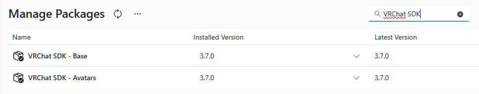
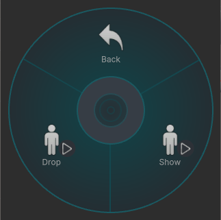
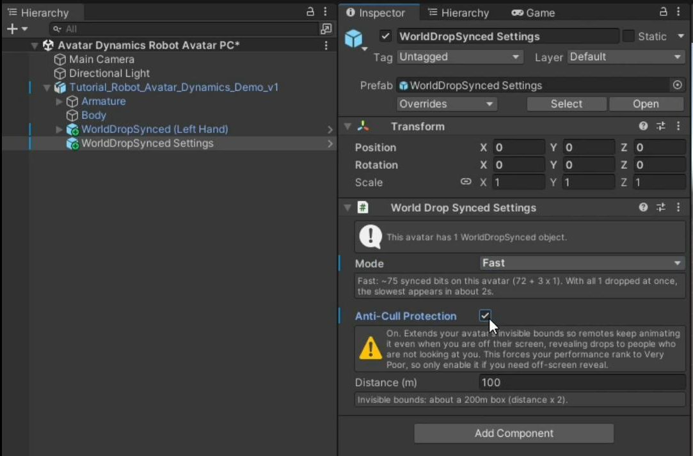

# VRCWorldDrop

**World drop toggles for VRChat avatars**. Drag-n-drop installation with VRCFury. Late-joiner sync. Quest compatible!

Add your custom object to the prefab, set the menu path, and upload. Copy-paste onto other avatars to reuse!

[**Add to VCC**](https://gummidot.github.io/vpm-listing/) | [**.unitypackage**](https://github.com/gummidot/VRCWorldDrop/releases/latest)

## Regular vs. Synced Prefabs

| | Regular | Synced |
| --- | --- | --- |
| Late-joiner sync | No, re-drop when players join | Yes |
| Cost (per object) | 2 synced bits, 2 constraints | 3 synced bits, ~12 constraints ~15-20 *local* contacts |
| Base cost (per avatar) | none | 24-40 synced bits (Slow) / 40-72 synced bits (Fast), by object count |

Use the **synced** world drops if you need late-joiners to see the object in the same spot. Otherwise the **regular** world drops are lighter on performance, but you will have to re-drop them when new players join.

## Requirements

- [VRCFury](https://vrcfury.com/)
- VRChat SDK:
  - Regular: **3.7.0 or later**
  - Synced: **3.10.4 or later** (**IMPORTANT!!** check VCC if you haven't updated your project since June 17, 2026)

  

## Installation

**VCC (recommended):** Click [**Add to VCC**](https://gummidot.github.io/vpm-listing/) to add the listing, then install **VRCWorldDrop** from the package list.

**Unity package:** Download the `.unitypackage` from the [releases page](https://github.com/gummidot/VRCWorldDrop/releases/latest) and import it.

## Regular world drop

Prefabs come with two menu toggles:

- **Show** shows or hides the object (hidden by default)
- **Drop** drops the object or picks it back up

You can change where the object drops from by choosing the right prefab:

| Prefab                   | Rotation                     | Drops from            |
| ------------------------ | ---------------------------- | --------------------- |
| `WorldDrop`              | Rotates with avatar (Y-only) | Avatar (fixed height) |
| `WorldDrop (Hips)`       | Rotates with avatar (Y-only) | Hips (height adjusts) |
| `WorldDrop (Left Hand)`  | Full rotation                | Left hand             |
| `WorldDrop (Right Hand)` | Full rotation                | Right hand            |

### Avatar Scaling

The default prefabs do not scale with your avatar. If you want objects to scale when adjusting avatar height in-game, use the **Scaled** prefabs.

### Performance

- Default prefabs: 2 bits, 2 VRC constraints.
- Scaled prefabs: 2 bits, 1 VRC constraint.

### Set up

<video src="https://github.com/user-attachments/assets/1e3bbb1e-d48d-4b4c-8b7a-936eb438f558"></video>

1. Find the `Prefabs` folder and drag one of the prefabs onto your avatar.
   - VCC: `Packages/VRCWorldDrop/Prefabs`
   - Unity package: `Assets/VRCWorldDrop/Prefabs`
2. Right click the prefab and select **Prefab > Unpack Completely**.
3. Expand the prefab and replace the default `Cube` with your object.
4. Move the `Reset Target` to where you want to drop the object from, e.g. on the ground or from your hand.
5. Change the `Menu Prefix` in the prefab's **VRCFury Full Controller** component to where you want the toggle menu.

Optional steps:

6. Rename the prefab to match your object for better organization.
7. To hide the object in your Scene (or for users that turn off avatar animations), disable the `Container` game object.
8. Set the object's lighting **Anchor Override** to itself so it lights with itself and not your avatar.

### Modifying the prefab

- To change the drop location to a different body part like `Head`, edit the `Reset Target`'s **VRCFury Armature Link** component, setting `Link To` to a different part.
- To disable rotation with hands, edit the `Container`'s **VRC Parent Constraint**, unchecking `Freeze Rotation Axes` for `X` and `Z`.

## Synced world drop

Sync up to **16 objects** for late-joiners. There are a few limitations to be aware of:

- **Drop delay** for remote users: ~3s for a few objects, up to ~14s with 16 objects shown. *Fast* mode speeds it up to ~2-7s at the cost of more synced params.
- **Accuracy**: objects may be offset by ~0.4 cm once dropped (barely noticeable)
- **Range**: ~4 km from world origin (should cover most worlds)

### Performance

Synced drops require **24 to 40 bits** of synced params per avatar (or **40 to 72 bits** on *Fast* mode), depending on how many objects you sync:

| Objects | Base cost (Slow) | Base cost (Fast) |
| --- | --- | --- |
| 1-2 | 24 bits | 40 bits |
| 3-5 | 32 bits | 56 bits |
| 6-16 | 40 bits | 72 bits |

Each object then adds:

| Rotation | Synced params | VRC constraints | Local contacts |
| --- | --- | --- | --- |
| Y-only | 3 bits | 11 | 15 |
| Full rotation | 3 bits | 12 | 20 |

Note that local contacts don't affect your performance rank, but they do count toward the limit of 256 contacts per avatar.

### Prefabs

You can change where the object drops from by choosing the right prefab:

| Prefab | Rotation | Drops from |
| --- | --- | --- |
| `WorldDropSynced (Avatar)` | Rotates with avatar (Y-only) | Avatar (fixed height) |
| `WorldDropSynced (Hips)` | Rotates with avatar (Y-only) | Hips (height adjusts) |
| `WorldDropSynced (Left Hand)` | Full rotation | Left hand |
| `WorldDropSynced (Right Hand)` | Full rotation | Right hand |
| `WorldDropSynced (Left Hand, Y-only)` | Rotates with hand (Y-only) | Left hand |
| `WorldDropSynced (Right Hand, Y-only)` | Rotates with hand (Y-only) | Right hand |

### Avatar Scaling

The default prefabs do not scale with your avatar. If you want objects to scale when adjusting avatar height in-game, use the **Scaled** prefabs. Note that these will add 1 extra VRC constraint.

### Set up

<video src="https://github.com/user-attachments/assets/50837545-86ec-4384-8fc5-b5d1650c7325"></video>

1. Find the `Synced/Prefabs` folder and drag the variant you want onto your avatar (see the table above).
   - VCC: `Packages/VRCWorldDrop/Synced/Prefabs`
   - Unity package: `Assets/VRCWorldDrop/Synced/Prefabs`
2. Expand the prefab and replace the sample arrow under `Container/Item` with your object. No need to unpack the prefab, you can delete the sample arrow without unpacking.
3. Move the `Reset Target` to where you want to drop the object from, e.g. on the ground or from your hand.
4. Set the **Menu Path** in the prefab's inspector to where you want the toggle menu, e.g. `Props/Tent`.
5. Repeat for each object you want to drop (up to 16 per avatar), then upload. Each object gets its own **Show** and **Drop** toggle.

Optional steps:

6. Rename the prefab to match your object for better organization.
7. To choose whether the object starts visible in-game, use **Default Shown** in the inspector. To hide it in the Scene view, disable `Container/Item` (not `Container`).
8. Set the object's lighting **Anchor Override** to itself so it lights with itself and not your avatar.

### Settings

For optional settings, drag a **`WorldDropSynced Settings`** object onto your avatar:

- **Mode:** *Slow* mode by default (~3-14s delay, ~24-40 synced bits depending on object count). *Fast* mode cuts the delay roughly in half at the cost of more synced params (~2-7s delay, ~40-72 bits). The Settings inspector shows the exact synced param cost.
- **Anti-Cull Protection:** Off by default. After you hide and reshow a drop, remote users may not see it until they look at your avatar due to animator culling. Turn this on to prevent objects from being hidden when you reshow them. This uses an invisible object to extend your avatar bounds, so you will be **Very Poor** ranked. Leave it off unless you really need it.

### Custom Menu Toggles

To use your own menu toggles instead of the built-in Show/Drop ones (e.g. to integrate with your own asset):

1. On the **World Drop Synced** component, expand **Use your own menu**.
2. Set **Drop Param** / **Show Param** to your own avatar bool parameters. Setting either hides the built-in menu.
3. Make those parameters **local**. The drops are synced internally.

See the [VRCFury toggles example](Assets/VRCWorldDrop/Synced/Examples/VRCFury%20Toggles) and the [FX controller example](Assets/VRCWorldDrop/Synced/Examples/FX%20Controller).

If distributing your own asset, include VRCWorldDrop as a dependency (either the `.unitypackage` or the `com.gummidot.vrc-world-drop` VCC package as a dependency).

Note that synced drop limits will be shared between your asset and any other synced drops on the avatar (up to 16 per avatar with the same synced param budget).

### How it works

- Box-shaped contacts with `Use Face Proximity` measure an object's X/Y/Z position and Forward/Up direction based off the world origin
- Contacts are limited to a 3m radius, so position constraints compress longer distances down to cover a whole world while staying fairly accurate
- On your own client, position/direction are read into synced params that then get sent to remote users in chunks. This is why drop delay increases with more objects, and speeding it up costs more synced params.
- Remote users and late-joiners reconstruct the position and rotation of the object using a position constraint and an aim constraint
- Finally, the object is frozen in place and stops syncing for better animator performance

## Acknowledgments

Many thanks to VRLabs for the inspiration. The regular world drop is largely based on [World-Constraint](https://github.com/VRLabs/World-Constraint), and the synced world drop borrows a lot of the same techniques used by [Custom-Object-Sync](https://github.com/VRLabs/Custom-Object-Sync).
